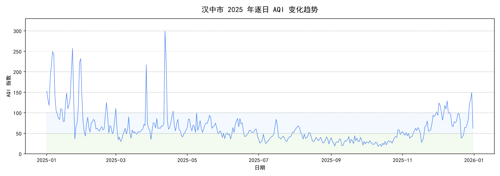
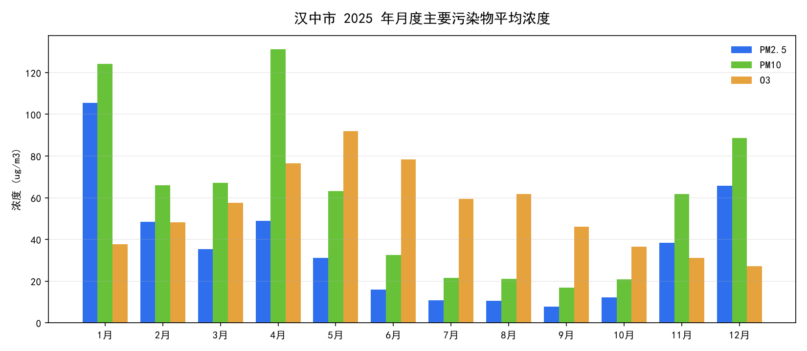
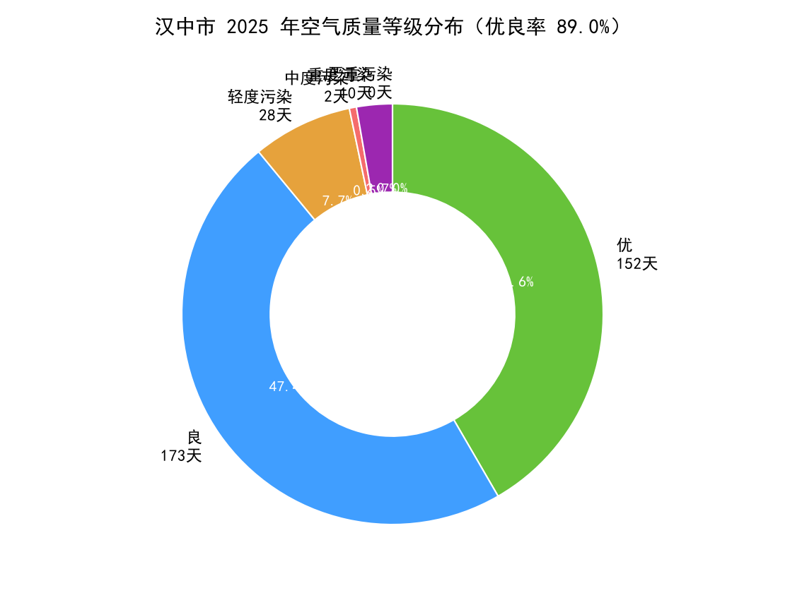
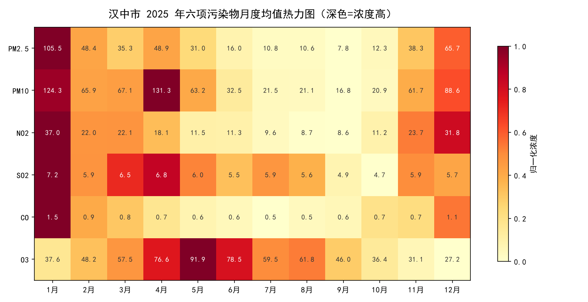
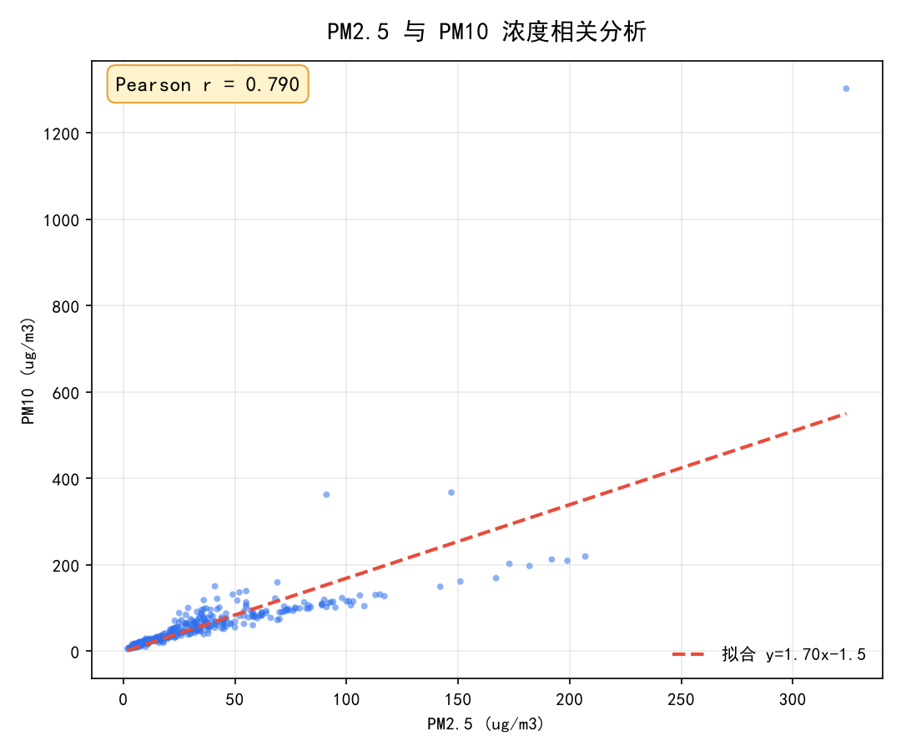
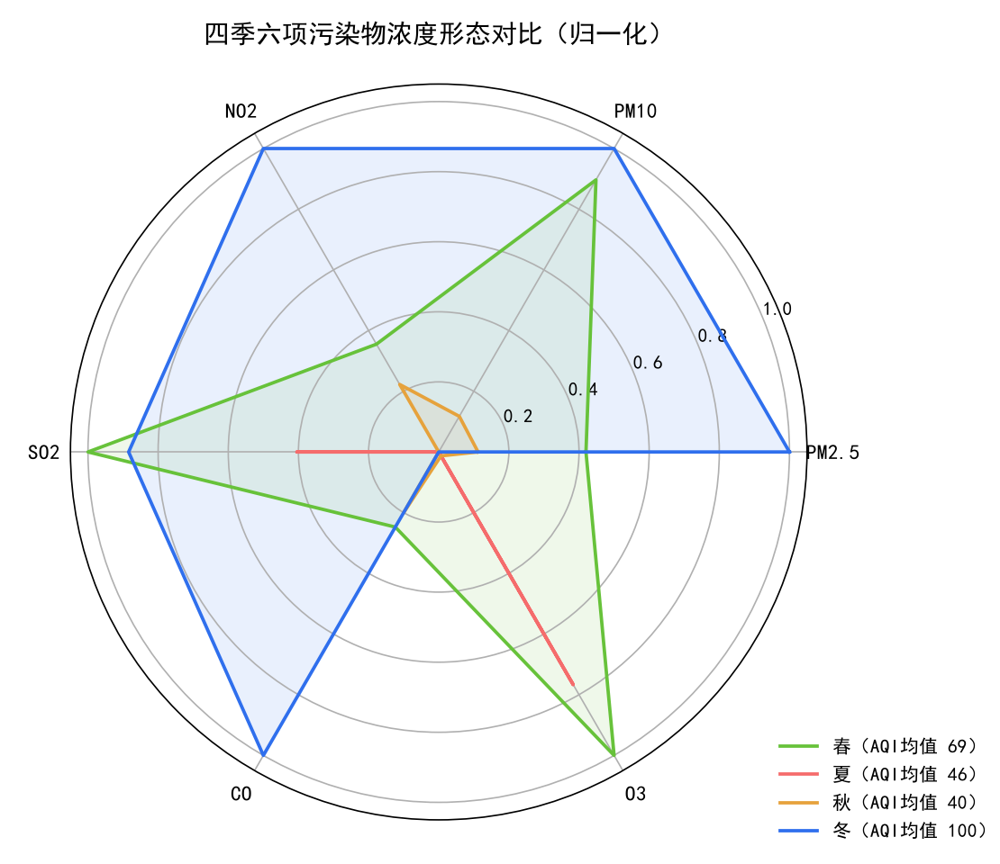
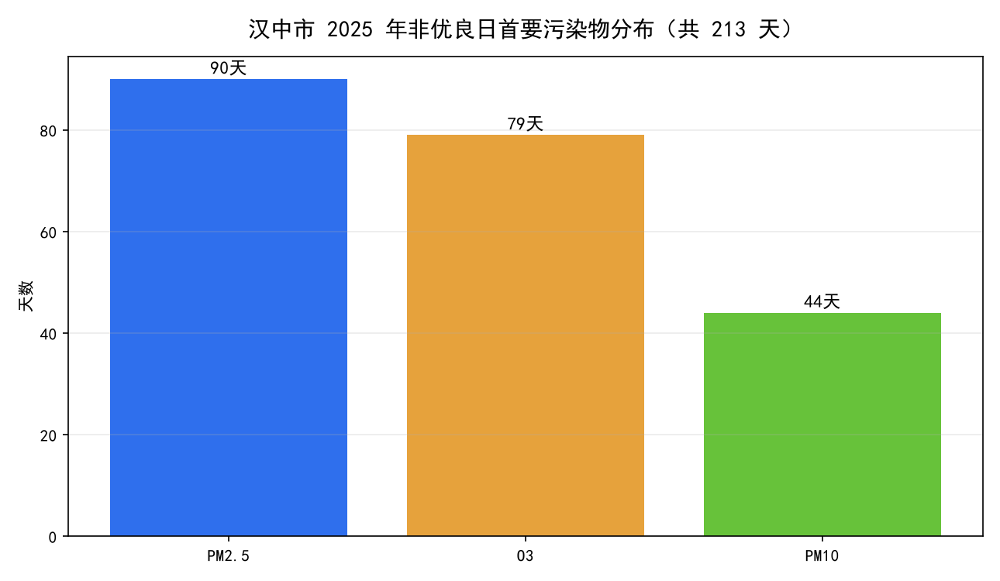
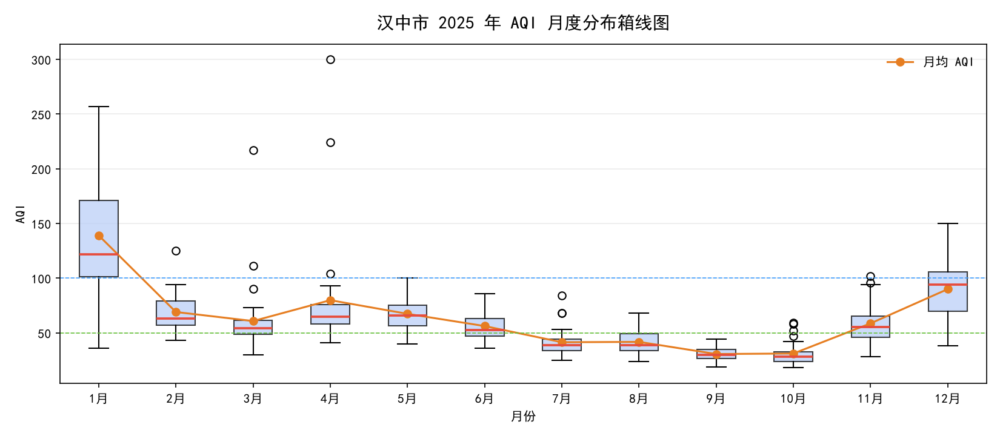

# 汉中城市空气质量数据分析（2025）

基于汉中市 2025 年全年逐日监测数据的空气质量分析项目：数据采集 → 清洗统计 → 可视化 → 交互式分析驾驶舱，完整呈现从原始数据到可交互结论的全过程。

## 项目简介

- **数据**：汉中市 2025-01-01 ~ 2025-12-31 共 365 天逐日监测，无缺失
- **指标**：AQI、PM2.5、PM10、NO2、SO2、CO、O3 共 8 项
- **成果**：8 张静态分析图 + 一个五标签页的 Streamlit 交互驾驶舱
- **结论**：全年优良率 89.0%，PM2.5 与 AQI 相关系数 0.95，冬季 PM2.5 是主要矛盾，春季外来沙尘为极端过程

## 技术栈

`Python 3.11` · `pandas`（数据处理）· `Matplotlib`（静态图表）· `Plotly`（交互图）· `Streamlit`（Web 驾驶舱）

## 核心功能

1. **总览驾驶舱**：KPI 指标卡、AQI 逐日趋势、等级构成、首要污染物
2. **污染物分析**：月度浓度对比（多选）、月度热力图、AQI 月度箱线图
3. **相关性分析**：相关系数矩阵、双变量散点联动
4. **日历热力图**：全年 AQI 按星期日历分布
5. **数据浏览**：明细表、描述统计、CSV 导出

侧边栏支持日期区间、季节、月份一键筛选，全页面联动重算。

## 主要结论

| 指标 | 数值 |
|---|---|
| 优良天数比例 | 89.0%（325 / 365 天） |
| 全年平均 AQI | 63.9（二级） |
| 重度及以上污染 | 10 天 |
| 最重月份 | 1 月，月均 AQI 139 |
| 极端过程 | 4 月 12 日沙尘，AQI 300、PM10 1302 μg/m³ |
| PM2.5 ↔ AQI 相关系数 | 0.95 |

- 污染呈典型冬季型：冬季采暖叠加盆地地形不利扩散，PM2.5 是首要矛盾
- 首要污染物季节分工：PM2.5（冬季 90 天）/ O3（夏季 79 天）/ PM10（春季沙尘 44 天）
- PM2.5 与 O3 呈弱负相关（-0.25），冬夏此消彼长

## 分析图表










## 项目结构

```
hanzhong_air/
├── app.py                     # Streamlit 交互式驾驶舱（主交付物）
├── fetch_data.py              # 数据抓取
├── analyze_basic.py           # 数据核验 + 描述性统计
├── analyze_extreme.py         # 极端过程 + 首要污染物计算
├── make_charts.py             # 8 张静态图生成
├── verify_daterange.py       # 区间过滤自动验证
├── hanzhong_aqi_2025.csv           # 原始逐日数据（365 天）
├── hanzhong_aqi_2025_analyzed.csv # 分析数据（含衍生字段）
└── charts/                    # 8 张静态分析图
```

## 运行方式

```bash
# 安装依赖
pip install -r requirements.txt

# 启动交互式驾驶舱
streamlit run app.py
```

浏览器打开 `http://localhost:8501` 即可。

## 数据说明

- 来源：天气后报（tianqihoubao.com）汉中市逐日监测（24 小时均值）
- 等级划分依据《环境空气质量指数（AQI）技术规定》（HJ 633—2012）
